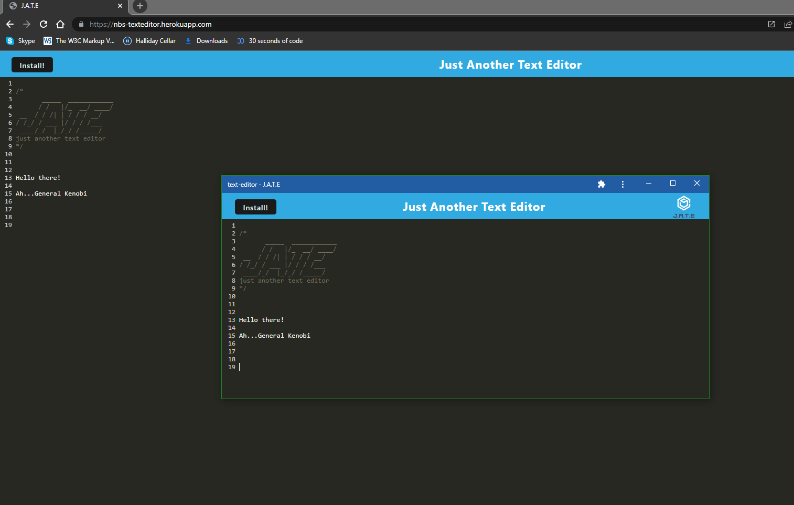

## JATE - Steve Barry

## <span style="color:green"> The Task</span>

The task was to build a text editor that runs in the browser. The app should be a single-page application that meets the PWA criteria. Additionally, it will feature a number of data persistence techniques that serve as redundancy in case one of the options is not supported by the browser. The application will also function offline.

### ⭐ ⭐ S.T.A.R. ⭐ ⭐

**SITUATION**

The provided user story was: 

> <span style="font-style:italic">AS A developer</span>
> 
> <span style="font-style:italic">I WANT to create notes or code snippets with or without an internet connection</span>
>
> <span style="font-style:italic">SO THAT I can reliably retrieve them for later use</span>

**TASK**

Provide an app so that a user may make notes reliably, whether they're offline or online.

**ACTION**

Writing of a solution to resolve the situation, including:
* Layout
  * *Simple, yet attractive design*
  * *Logical layout*
  * *Improved code visualisation - eg: indentation*
  * *Error free loading*
  * *Thorough comments*
* Javascript
  * *Error free performance*
  * *Multiple functions to separate aspects of code*
  * *Thorough comments*
* GIT
  * *Numerous commits to track changes in code*
  * *Code deployed to Github and Heroku for public viewing*
* FUNCTIONALITY
  * *App works both offline and offline*
  * *Reloaded browser will retain data from installed app*
  * *Comment feature*

**RESULT**

The end code is stored on Github, and publicly available and viewable. This result meets all requirements of the User Story and acceptance criteria:

```md
GIVEN a text editor web application
WHEN I open my application in my editor
THEN I should see a client server folder structure
WHEN I run `npm run start` from the root directory
THEN I find that my application should start up the backend and serve the client
WHEN I run the text editor application from my terminal
THEN I find that my JavaScript files have been bundled using webpack
WHEN I run my webpack plugins
THEN I find that I have a generated HTML file, service worker, and a manifest file
WHEN I use next-gen JavaScript in my application
THEN I find that the text editor still functions in the browser without errors
WHEN I open the text editor
THEN I find that IndexedDB has immediately created a database storage
WHEN I enter content and subsequently click off of the DOM window
THEN I find that the content in the text editor has been saved with IndexedDB
WHEN I reopen the text editor after closing it
THEN I find that the content in the text editor has been retrieved from our IndexedDB
WHEN I click on the Install button
THEN I download my web application as an icon on my desktop
WHEN I load my web application
THEN I should have a registered service worker using workbox
WHEN I register a service worker
THEN I should have my static assets pre cached upon loading along with subsequent pages and static assets
WHEN I deploy to Heroku
THEN I should have proper build scripts for a webpack application
```

## <span style="color:green"> The Outcome</span>

As the acceptance criteria has been met and the task is now complete. 

You can view the Github repo [HERE](https://github.com/NBS5000/textEditor/)

You can view the finished solution [HERE](https://nbs-texteditor.herokuapp.com/)

Alternatively, here is a screenshot:

> 

Assisted by Rachel Harris.

---
<p style="text-align:center;">Written by <span style="font-style:italic">Steve Barry</span> - Due date 19/04/2022</p>

<p style="text-align:center;">© 2021 Trilogy Education Services, LLC, a 2U, Inc. brand. Confidential and Proprietary. All Rights Reserved.</p>
